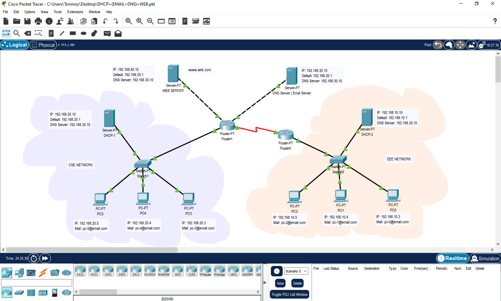

# Cisco Packet Tracer Project: Integrated Network Services

This project, created in Cisco Packet Tracer, demonstrates a comprehensive network setup integrating several key services: DHCP, DNS, Email (SMTP/POP3), and a Web Server (HTTP). It's designed to simulate a small office or campus environment where clients can automatically receive network configurations, resolve domain names, exchange emails, and access a central web server.

## Network Topology

The network consists of a central router and a switch connecting multiple end devices, including PCs and servers. Each server is dedicated to providing a specific service (DHCP, DNS, Email, Web). The topology is designed for clarity and to showcase the interaction between the different network services.

## Services Implemented ⚙️

### 1. DHCP (Dynamic Host Configuration Protocol)
- A dedicated DHCP server is configured to automatically assign IP addresses, subnet masks, default gateways, and DNS server addresses to all client PCs on the network.
- This eliminates the need for manual static IP configuration on each end device, simplifying network management.

### 2. DNS (Domain Name System)
- A DNS server is set up to resolve domain names to their corresponding IP addresses.
- It holds records for the web server (e.g., `www.example.com`) and the email server (e.g., `mail.example.com`), allowing users to access services using memorable names instead of IP addresses.

### 3. Email Service (SMTP & POP3)
- An Email server is configured to handle sending (SMTP) and receiving (POP3) of emails.
- User accounts are created on the server, allowing clients to configure their email clients and communicate with each other within the simulated network.

### 4. Web Service (HTTP)
- A Web server hosts a simple HTML web page.
- Client PCs can access this web page by entering its domain name (e.g., `www.example.com`) into a web browser, demonstrating the successful integration of HTTP and DNS services.

## How to Use and Test 💡

To explore and test the functionalities of this network:

1.  **Open the Project:** Launch Cisco Packet Tracer and open the `DHCP+(EMAIL+DNS)+WEB.pkt` file.
2.  **Test DHCP:**
    - Select any PC and open its IP Configuration settings.
    - Switch from "Static" to "DHCP".
    - Verify that the PC successfully obtains an IP address, subnet mask, default gateway, and DNS server address from the DHCP server.
3.  **Test DNS and Web Service:**
    - On a PC that has received its IP configuration, open the "Web Browser" application.
    - In the URL bar, type the domain of the web server (e.g., `www.example.com` - you can find the exact domain in the DNS server's configuration).
    - The browser should display the custom HTML page hosted on the web server.
4.  **Test Email Service:**
    - **Configure Email Clients:**
        - Select a PC and open the "Email" client application.
        - Configure the client with a user's name, email address, incoming mail server (e.g., `mail.example.com`), outgoing mail server (e.g., `mail.example.com`), and the username/password for an account pre-configured on the Email server.
        - Repeat for a second PC with a different user account.
    - **Send an Email:**
        - From the first PC's email client, compose and send a new email to the second PC's email address.
    - **Receive an Email:**
        - On the second PC, click the "Receive" button in its email client.
        - The email sent from the first PC should appear in the inbox.

## License 📜
This project has no license.

## Important Links 🔗
- **Repository Link:** [https://github.com/tonmoylive/Network-DHCP](https://github.com/tonmoylive/Network-DHCP)

## Fork it 🍴
If you find this project helpful, consider forking it to explore and implement your own improvements.
Also, feel free to contribute, suggest improvements, report bugs, request features.

<footer>
  
© 2025 <a href="https://github.com/tonmoylive/Network-DHCP">Network-DHCP</a> by <a href="https://mdanikbiswas.rf.gd/">MD ANIK BISWAS</a>

  
 Feel free to contribute ,report bugs , request features, like and give a star ⭐ to this repository. 

</footer>
